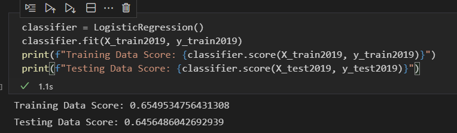
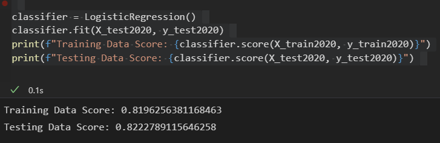
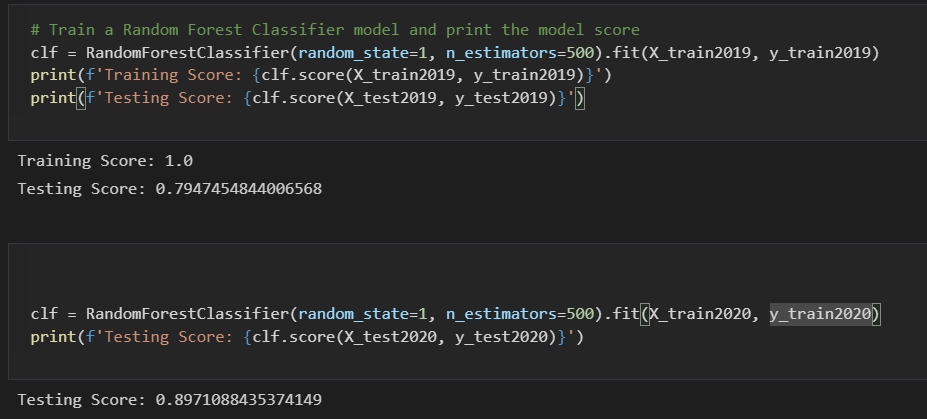
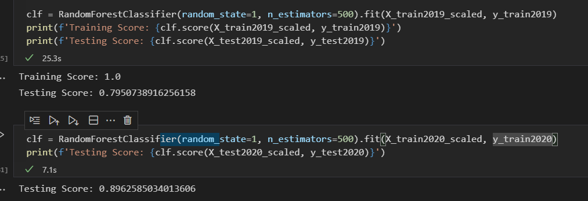

# loan_prediction_model

Considering the enormous difference in volume of High Risk and Low Risk loans within the dataset, and the variety of categorical values within the dataset, I would predict that a Random Forest is going to greatly out perform a Logistic regression, as the Trees will be able to sort the data more effectively than a Logistic regression. 

My computer nearly went on strike before I got through the unscaled data, and unsurprisingly the models were more accurate post scaling 

I was right!

here are some screenshots of the solution for easy viewing. 

